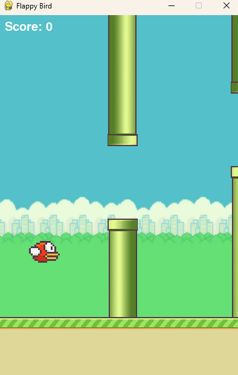

# Flappy Bird en Python

Este es un juego de **Flappy Bird** desarrollado en **Python** utilizando la biblioteca **Pygame**. El objetivo del juego es hacer volar un pájaro entre tuberías sin tocarlas. Los jugadores deben presionar la barra espaciadora para hacer que el pájaro vuele y evitar caer o chocar con las tuberías.

<p align="center">
  
</p>

## Características

- Juego clásico de **Flappy Bird**.
- El jugador controla un pájaro que debe evitar las tuberías.
- El juego genera tuberías de forma aleatoria y las mueve hacia la izquierda.
- El jugador puede ganar puntos por evitar las tuberías y por cada tubería superada.
- El juego muestra el puntaje al final y permite reiniciar después de perder.

## Requisitos

Para ejecutar este juego, necesitas tener **Python 3.x** instalado y la biblioteca **Pygame**.

### Instalación de Pygame

Si aún no tienes **Pygame** instalado, puedes hacerlo ejecutando el siguiente comando:

```bash
pip install pygame
